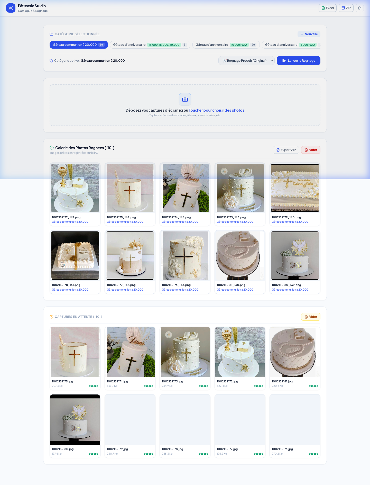

# 🎂 Pâtisserie Studio — Catalogue & Rognage Intelligent

[](https://fastapi.tiangolo.com/)
[](https://www.python.org/)
[](https://opencv.org/)
[](https://www.sqlite.org/)
[](LICENSE)

Une application web haute performance et ultra-intuitive conçue pour les pâtisseries et boutiques e-commerce. Elle transforme automatiquement vos captures d'écran de produits (gâteaux, viennoiseries, créations) en un **catalogue professionnel rogné, catégorisé avec prix extraits et registre Excel prêt à l'emploi.**

---

## 📸 Aperçu de l'Interface



---

## ✨ Fonctionnalités Clés

- 🚀 **Importation Massive & Fluide** : Déposez ou capturez des dizaines de photos depuis votre téléphone ou votre ordinateur.
- 🏷️ **Extraction Automatique des Prix** : Détection intelligente des prix (`15 000 FCFA`, `10 000f`, `20000 francs`) dans les noms de fichiers ou de catégories.
- ✂️ **Rognage Intelligent par Vision par Ordinateur (OpenCV)** :
  - Détection automatique de la zone de cadrage du produit (Sobel, gradients, analyse de contrastes).
  - Normalisation du format d'image pour un rendu propre et harmonieux.
- 📊 **Registre Excel Dynamique** : Génération instantanée d'un fichier `.xlsx` structuré (*Référence, Nom du Produit, Catégorie, Prix, Chemin du Fichier*).
- 📦 **Exportation ZIP & Téléchargements** : Exportez la galerie complète des visuels rognés ou le registre Excel en un seul clic.
- 📱 **Interface 100% Mobile Responsive** : Design épuré Blanc-Bleu premium, optimisé pour les smartphones iOS/Android et tablettes.
- ⚡ **Suivi du Traitement en Temps Réel** : Barre de progression dynamique et état des tâches asynchrones.

---

## 🛠️ Architecture Technique

```
Automatisation/
├── app/
│   ├── main.py               # Point d'entrée FastAPI & configuration de l'application
│   ├── db.py                 # Gestion SQLite3, migrations & slugs uniques
│   ├── config.py             # Chemins & constantes de l'application
│   ├── routes/
│   │   ├── categories.py     # Endpoints CRUD pour les catégories
│   │   ├── upload.py         # Endpoints de téléversement et nettoyage des bruts
│   │   ├── process.py        # Endpoints du moteur de traitement & galerie
│   │   └── export.py         # Endpoints d'exportation Excel & ZIP
│   ├── services/
│   │   ├── processor.py      # Algorithme d'analyse d'image OpenCV & rognage
│   │   └── excel.py          # Générateur de registres openpyxl
│   ├── templates/            # Vues HTML5 sémantiques (index.html)
│   └── static/               # Assets statiques (CSS moderne & Javascript ES6)
├── assets/                   # Captures d'écran & médias de démonstration
├── catalogue_final/          # Dossier des produits rognés et registres Excel
├── uploads_bruts/            # Stockage temporaire des captures brutes
├── pyproject.toml            # Configuration des dépendances Python (uv)
└── database.db               # Base de données SQLite
```

---

## 🚀 Installation & Démarrage Rapide

### Prérequis
- **Python 3.10+**
- **uv** (recommandé pour une installation rapide) ou **pip**

### 1. Cloner le dépôt
```bash
git clone https://github.com/Alpha2-far/automatisation-patisserie.git
cd automatisation-patisserie
```

### 2. Créer l'environnement virtuel & Installer les dépendances

**Avec `uv` (Recommandé) :**
```bash
uv venv
source .venv/bin/activate  # Sur macOS/Linux
# ou .venv\Scripts\activate Sur Windows

uv sync
```

**Avec `pip` classique :**
```bash
python3 -m venv .venv
source .venv/bin/activate
pip install fastapi uvicorn pillow opencv-python-headless openpyxl
```

### 3. Lancer le serveur local
```bash
uv run uvicorn app.main:app --host 0.0.0.0 --port 8000
```

Accédez à l'application dans votre navigateur :
- 💻 **PC / Mac** : [http://localhost:8000](http://localhost:8000)
- 📱 **Mobile (sur le même réseau Wi-Fi)** : `http://<IP-DE-VOTRE-MAC>:8000`

---

## 🧪 Tests Automatisés

Le projet intègre une suite de tests unitaires et d'intégration validant l'ensemble de la logique métier, de la base de données et des routes d'API :

```bash
uv run pytest -v
```

Les tests couvrent :
- **Base de données & Prix** : normalisation des slugs, extraction regex des prix (FCFA/francs), intégrité relationnelle et nettoyage de répertoire sur disque.
- **Service Excel** : initialisation avec en-têtes stylisés et insertion de données.
- **Endpoints FastAPI** : `/api/health`, `/api/categories`, téléversement d'images, exports Excel & ZIP.

---

## 🧭 Cartographie & Graphe de Connaissances (Graphify / Engram)

Le codebase est indexé par **Graphify / Engram** pour naviguer dans l'architecture et les relations de code :

```bash
# Mettre à jour le graphe d'architecture
graphify update .

# Exporter le studio interactif
graphify studio export .engram/studio
```

- 📊 **Rapport synthétique** : `.engram/GRAPH_REPORT.md`
- 🌐 **Studio visuel hors-ligne** : Ouvrez `.engram/studio/studio.html` dans votre navigateur.

---

## 📖 Guide d'Utilisation

1. **Créer une Catégorie** : Entrez le nom de la catégorie (ex: `Gâteau d'anniversaire à 15000 FCFA`). Le prix est automatiquement extrait !
2. **Sélectionner des Photos** : Glissez-déposez ou sélectionnez des captures d'écran du produit.
3. **Lancer le Rognage** : Cliquez sur **Lancer le Rognage** et observez la magie OpenCV en temps réel.
4. **Exporter** : Téléchargez le registre Excel complet ou l'archive ZIP de toutes les images rognées.

---

## 📄 Licence

Développé sous licence MIT. Libre d'utilisation et de modification pour vos projets personnels ou commerciaux.

